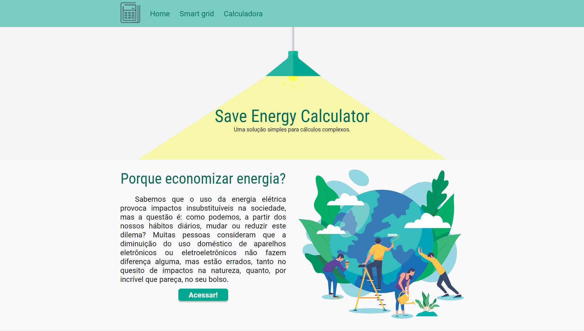
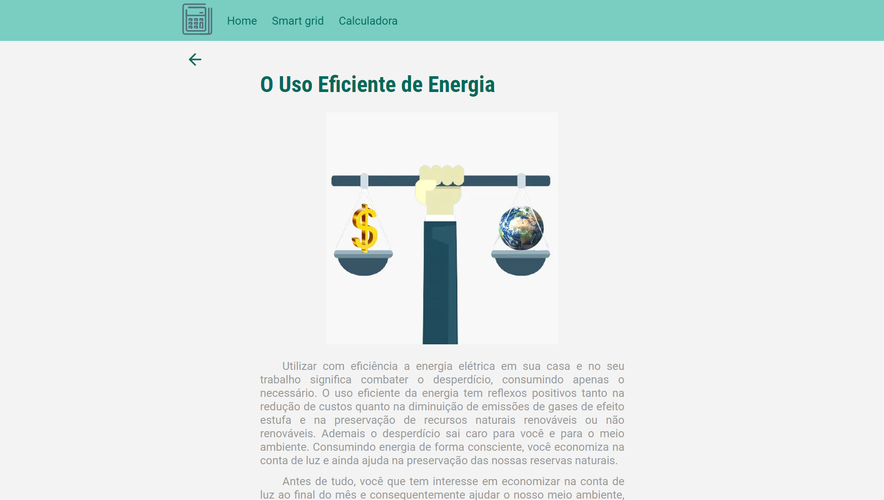
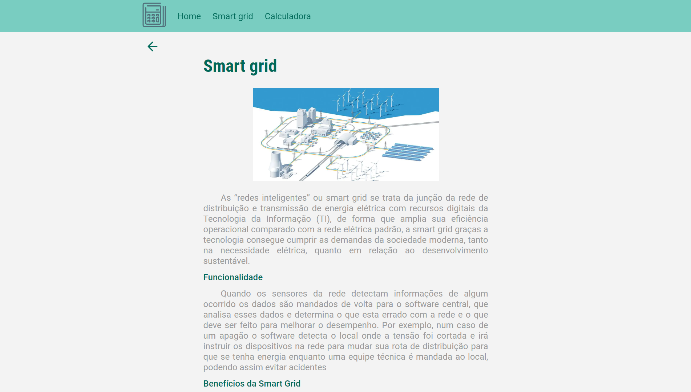
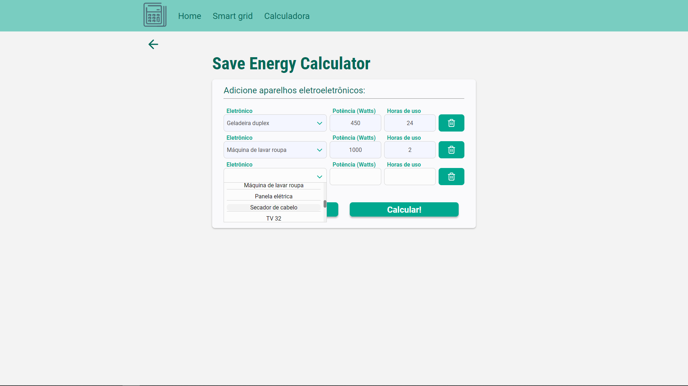
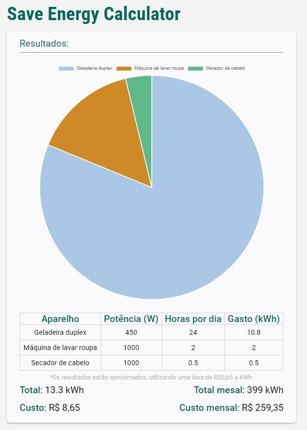

# Save Energy Calculator

https://save-energy-calculator.vercel.app/

Projeto integrador desenvolvido no primeiro semestre de engenharia de computação da UNISAL - Lorena.
## Descrição

Calculadora de consumo e textos informativos sobre *smart grid* e impactos do gasto de energia no meio ambiente.

Desenvolvido usando [next.js](https://nextjs.org/).

## Getting started
Para executar o projeto em ambiente de desenvolvimento basta instalar as dependências e executar em *dev*
```bash
  # instalar as dependências 
  yarn ou npm install

  # executar em dev
  yarn dev ou npm run dev
```

## Screenshots
### Home


### Impacts on nature


### Smart grid


### Calculator


### Results

